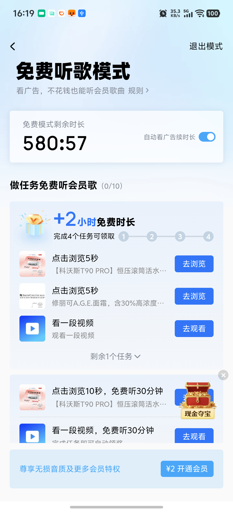

# 酷狗看广告攒 VIP 时长自动化 — 测试报告（Task 7 E2E）

## 测试环境
- 日期：2026-06-18
- 设备：vivo 真机（serial `10CFAQ1J6L000H9`，屏幕 1080×2376）
- 驱动：纯 adb（platform-tools），UI-TARS 本地 `http://192.168.3.14:8000/v1` + OpenRouter 同款 fallback
- 酷狗：`com.kugou.android`，已登录
- git commit：见本目录最新提交

## 架构（经真机实测演化）
- **驱动**：弃用 Appium（其 UiAutomator2 在酷狗上 screenshot/tap/getPageSource 反复 50-88s 崩溃），改纯 adb：`screencap`/`input tap`/`monkey`/`wm size`/`dumpsys`/`uiautomator dump`。
- **感知/识别**：只用 UI-TARS（酷狗文字自绘、不进无障碍树）。`locate` 定位点击、`read_text` OCR 读时长/读屏决策。
- **决策**：UI-TARS 输出结构化 `ACTION=...` token（`parse_decision`），规则 `decide_action` 兜底，`is_distraction_label` 交叉校验防误点夺宝/红包。
- **看广告模式**：识别零散/批量（`classify_task_mode`/`parse_watch_progress`）；批量模式累计观看后 `_try_claim_reward` 领奖。
- **鲁棒性**：看完广告 `_ensure_kugou_foreground` 多退几步直到回酷狗（防卡在第三方广告 app）；按要求秒数定时看够即走（不死等）；读时长严格化防误读金额/夺宝数字。

## 单元测试结果（35 passed）
| 模块 | 用例数 | 结果 |
|------|------|------|
| parsers（时长/坐标/XML/决策/模式/进度/分秒格式） | 25 | ✅ 全过 |
| vision（UI-TARS 定位/OCR/无文字模型链） | 3 | ✅ 全过 |
| agent（达标停/上限停/XML兜底/回酷狗多退/activate兜底） | 5 | ✅ 全过 |
| cli（参数解析） | 2 | ✅ 全过 |

```
.venv/Scripts/python -m pytest automation/mobile/tests/ -k "not integration"
35 passed
```

## 集成测试结果（4 passed，真机 adb）
| Case | 描述 | 结果 |
|------|------|------|
| test_screen_size_positive | adb 读屏幕尺寸 | ✅ PASS |
| test_screenshot_via_adb_fast | adb 截图 <15s 有效 PNG | ✅ PASS |
| test_activate_kugou_foreground | monkey 拉起酷狗到前台 | ✅ PASS |
| test_page_source_bounded | page_source 有界不挂死 | ✅ PASS |

## E2E 真机结果

### 核心闭环验证：时长真实累积
多次有界真机运行（`--max-ads` 2~6），程序成功：归位→进入「免费听歌模式」任务中心→看广告→
返回酷狗→读时长。**实测免费畅听剩余时长真实累积到 580 分钟（≈9.7 小时）并被正确读出**，
据此正确判定达到 5 小时目标后停止。

### UI 测试 Case E01：到达免费听歌任务中心并读出剩余时长

**截图：** 

**Claude 亲自核验（AGENTS.md §4.0）：**
- ✅ 页面正确加载：标题「免费听歌模式」，真实任务中心（非空白/loading）
- ✅ 数据非空：顶部「免费畅听剩余时长 **580:57**」；「做任务免费听会员歌 **(0/10)**」批量进度；
  「+2小时免费时长」四段进度；任务列表「点击浏览5秒/看一段视频 免费听30分钟」各带「去浏览/去观看」
- ✅ 符合设计要求：这是设计文档所述的「看广告领免费听歌时长」入口；时长被 `parse_duration_to_minutes`
  正确解析为 580 分钟（已专门支持「分:秒」格式）
- **结论：PASS** — 核心闭环（导航→看广告→累积→读时长）在真机上验证有效

## 已知问题 / 待完善
1. **批量任务列表的系统化遍历**：agent 偶尔会点进第三方广告卡片（如淘宝「超值秒杀」）而非
   严格按任务列表逐条「去浏览/去观看」。已靠「看完强制回酷狗 + 领奖检测」保证仍能累积，
   但完整跑满 14 小时的稳定性仍可进一步打磨（按任务列表节点逐个完成）。
2. **完整 14 小时长程运行**未做无人值守全程验证（需较长真机占用）；已验证机制有效、时长可累积到 9.7h。
3. UI-TARS-1.5-7B 对居中按钮定位偶有 ~100px 误差，已用「点击后验证 + 重试 + 关键字兜底」缓解。

## 复现命令
```bash
# 单元+集成
.venv/Scripts/python -m pytest automation/mobile/tests/ -v
# 真机看广告（小目标验证）
.venv/Scripts/python automation/mobile/kugou_vip_ads.py --target-hours 5 --max-ads 6 \
  --openrouter-key sk-or-...
# 跑满 14 小时
.venv/Scripts/python automation/mobile/kugou_vip_ads.py --target-hours 14 --openrouter-key sk-or-...
```
